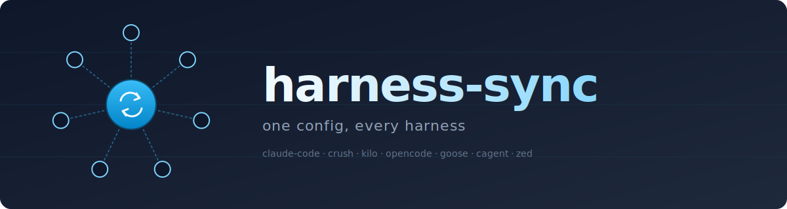
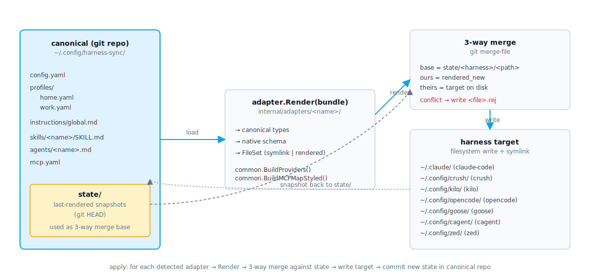
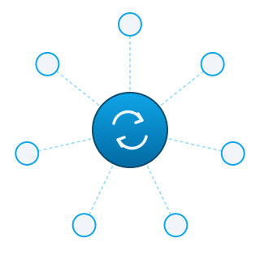

<p align="center">
  
</p>

<p align="center">
  <strong>One canonical source of truth</strong> for skills, agents, MCP servers, LLM endpoints, and global instructions across every LLM harness on your machine.
</p>

<p align="center">
  <a href="#install">Install</a> ·
  <a href="#first-run">First run</a> ·
  <a href="#architecture">Architecture</a> ·
  <a href="#supported-harnesses">Harnesses</a> ·
  <a href="#commands">Commands</a> ·
  <a href="#design">Design</a>
</p>

---

## The problem

You use claude-code, crush, kilo, opencode, goose, cagent, zed — pick any three.
Every one of them keeps **its own copy** of the things you'd want shared:

- the same skill markdown, duplicated seven ways
- the same agent definitions, rewritten per harness
- the same MCP server registry, with seven different key names (`mcpServers`, `mcp`, `context_servers`, `extensions`, …)
- the same LLM gateway URL and token, hand-copied into seven config files

Edit once. Forget the others. They drift. Things stop working in odd places.

---

## The fix

```
                 ┌──────────────────────────────────┐
                 │  ~/.config/harness-sync/  (git)  │
                 │                                  │
                 │  • profiles/<name>.yaml          │
                 │  • skills/<name>/SKILL.md        │
                 │  • agents/<name>.md              │
                 │  • mcp.yaml                      │
                 │  • instructions/global.md        │
                 └──────────────┬───────────────────┘
                                │  harness-sync apply
                  ┌─────────────┴─────────────┐
                  ▼                           ▼
        ┌───────────────────┐       ┌──────────────────┐
        │  per-harness      │       │  3-way merge     │
        │  adapter.Render() │  ◄──► │  via git         │
        └─────────┬─────────┘       │  merge-file      │
                  │                 └──────────────────┘
                  ▼
   ~/.claude/        ~/.config/crush/      ~/.config/kilo/
   ~/.config/opencode/  ~/.config/goose/   ~/.config/cagent/
   ~/.config/zed/
```

One canonical tree → seven harness-native configs, each with the correct keys.

<p align="center">
  
</p>

---

## Install

```bash
git clone https://github.com/lukaszraczylo/harness-sync
cd harness-sync
make build && make install      # installs to ~/.local/bin/harness-sync
```

Requires Go 1.22+ and `git` on `$PATH`.

---

## First run

```bash
harness-sync detect            # what's installed?
harness-sync init              # pick which to import from; canonical tree created
harness-sync apply             # propagate canonical to every detected harness
```

Real output on a machine with all seven harnesses installed:

```text
$ harness-sync detect
claude-code    detected
crush          detected
kilo           detected
opencode       detected
goose          detected
cagent         detected
zed            detected
```

`init` opens an interactive multi-select of detected harnesses
(use `--no-prompt` to take all, or `--from claude-code,crush` to be explicit).
On first apply, harness-sync writes a render snapshot under `state/<harness>/`
and commits the canonical tree — every subsequent apply is a `git merge-file`
three-way merge against that snapshot.

---

## Supported harnesses

Each row was grounded against the real config file on disk **and** the
harness's official docs before the adapter was written. Wrong key names
silently produce configs the harness can't parse — that's a bug class
harness-sync goes out of its way to avoid.

| Harness | Native config | MCP key | Model selector | Instructions | Symlinked |
|---|---|---|---|---|---|
| **claude-code** | `~/.claude/settings.json` (merged) | `mcpServers` | `env.ANTHROPIC_DEFAULT_MODEL` | `~/.claude/CLAUDE.md` | `skills/`, `agents/` |
| **crush** | `~/.config/crush/crush.json` (merged) | `mcp` (type: stdio\|http\|sse) | `default_model` | auto-read `AGENTS.md` | `skills/` |
| **kilo** | `~/.config/kilo/kilo.json` (merged) | `mcp` (type: local\|remote) | `model` + `small_model` | `instructions` array | `agent/` |
| **opencode** | `~/.config/opencode/opencode.jsonc` (merged) | `mcp` (type: local\|remote) | `model` | `AGENTS.md` | — |
| **goose** | `~/.config/goose/config.yaml` (merged) | n/a — `extensions` map (type: stdio) | `GOOSE_PROVIDER` + `GOOSE_MODEL` | env via `extensions.tom` | — |
| **cagent** | `~/.config/cagent/default.yaml` (starter) | `mcps` | per-agent `model:` | inline `instruction:` | — |
| **zed** | `~/.config/zed/settings.json` (merged) | `context_servers` (source: custom) | `agent.default_model.{provider,model}` | `~/.config/zed/rules/` | — |

> **Merged, not replaced.** For harnesses with user-managed config keys (every one
> except cagent), harness-sync reads the existing file, overlays only the keys
> it owns, and writes it back. Your hooks, permissions, language servers,
> editor settings — everything else — survive untouched.

Add a new harness: drop a Go package under `internal/adapters/<name>/`
implementing `adapter.Adapter`, register one line in `cmd/harness-sync/main.go`.

---

## Commands

```text
harness-sync detect                  list adapters + detection status
harness-sync show [harness...]       print files each adapter manages
                  --all              include not-detected harnesses
harness-sync init                    import from detected harnesses
                  --from a,b         pick adapters, skip prompt
                  --no-prompt        take all detected
harness-sync apply [harness...]      render + write
                  --dry-run          show plan, write nothing
                  --force            overwrite without 3-way merge
harness-sync diff [harness...]       apply --dry-run shorthand
harness-sync profile list            list canonical profiles
harness-sync profile use <name>      switch active profile + re-apply
harness-sync rollback [n]            git revert last N apply commits
harness-sync adapter list            print registered adapters
```

Every command accepts `--root <path>` to point at a non-default canonical tree.

---

## Profiles

A profile bundles the LLM stack — gateway URL, dummy token, model allowlist,
upstream provider keys. Switching profiles re-renders every harness in one
command.

```yaml
# ~/.config/harness-sync/profiles/home.yaml
name: home
gateway:
  url: https://gateway.lan
  token: dummy-local-token            # plaintext OK: gateway accepts any non-empty token
  default_model: claude-sonnet-4-6
upstreams:
  - name: anthropic
    api_key: ${ANTHROPIC_API_KEY}     # env-var substitution at render time
  - name: openai
    api_key: ${OPENAI_API_KEY}
  - name: ollama
    base_url: http://10.0.1.21:11434
models:
  - id: claude-sonnet-4-6
    alias: sonnet
  - id: claude-opus-4-7
    alias: opus
```

Dummy gateway tokens may be plaintext (they have no value if leaked).
Real provider keys **must** be `${VAR}` references — harness-sync substitutes
at render time so the canonical tree never contains plaintext secrets.

```bash
harness-sync profile use work        # switch the active profile…
harness-sync apply                   # …and re-render every harness
```

---

## Conflict resolution via git

Every `apply` is a git-style three-way merge:

```
base   ← state/<harness>/<path>        (last render harness-sync wrote)
ours   ← rendered_new                   (what harness-sync would write now)
theirs ← target file on disk            (what's actually there)
```

| Situation | Outcome |
|---|---|
| `target == ours` | skip (already in sync) |
| `target == base` | fast-forward write |
| disjoint changes | clean merge, write merged content |
| overlapping changes | write `<file>.rej` next to target, leave target alone, exit non-zero |

Resolve a `.rej`: open it, copy the bits you want into the target, delete the
`.rej`, run `apply` again. No bespoke conflict format — it's `<<<<<<<` markers
from `git merge-file`.

Roll back the last N applies: `harness-sync rollback 1` calls `git revert` on
the canonical repo, then re-renders.

---

## Architecture

A single Go binary, ~5000 LOC across 18 packages, 93 tests including an
end-to-end test that runs the real binary against a fake `$HOME`.

```
cmd/harness-sync/main.go              # cobra entrypoint + adapter registration
internal/canonical/                   # Bundle, Profile, MCPRegistry, Skill, Agent types + loader
internal/adapter/                     # Adapter interface, Registry, FileSet
internal/adapter/common/              # shared building blocks (BuildProviders, BuildMCPMapStyled, MergeJSONKeys, MergeYAMLKeys, …)
internal/adapters/<harness>/          # one package per harness, ~50-100 LOC of harness-specific glue
internal/apply/                       # render → 3-way merge → write pipeline + state snapshots
internal/merge/                       # git merge-file wrapper
internal/gitx/                        # thin shell wrapper over the git CLI
internal/render/                      # deterministic JSON / YAML / TOML marshallers
internal/secrets/                     # ${VAR} substitution with strict missing-key error
internal/cli/                         # cobra subcommands (detect, show, init, apply, diff, profile, rollback, adapter)
internal/ui/                          # huh-backed multi-select with non-interactive override for tests
tests/e2e/                            # binary-level integration test
```

DRY: the four pre-existing claude-code-like harnesses share `BuildProviders`,
`ProvidersAsMap`, `BuildMCPMapStyled`, `MergeJSONKeys`, `ImportMarkdownTree`,
`ParseFrontmatter`, and `StripJSONComments` from `internal/adapter/common/`.
The four MCP dialects (claude / crush / opencode / zed) sit in one switch,
so the right `type:` discriminator goes to the right harness.

---

## Design

- **Spec:** [`docs/superpowers/specs/2026-05-23-harness-sync-design.md`](docs/superpowers/specs/2026-05-23-harness-sync-design.md) — problem framing, canonical layout, adapter interface, merge semantics
- **Plan:** [`docs/superpowers/plans/2026-05-23-harness-sync.md`](docs/superpowers/plans/2026-05-23-harness-sync.md) — 26-task TDD implementation plan

Non-goals (v1): watcher daemon, GUI, remote sync (push the canonical git repo
yourself), keychain integration beyond env-var substitution.

---

## License

Same as the surrounding repository.

<p align="center">
  
</p>
